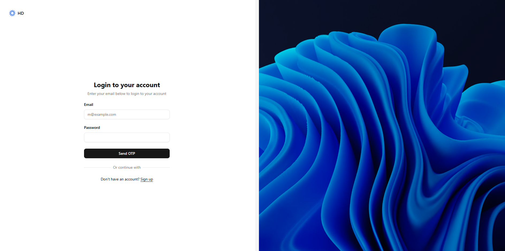
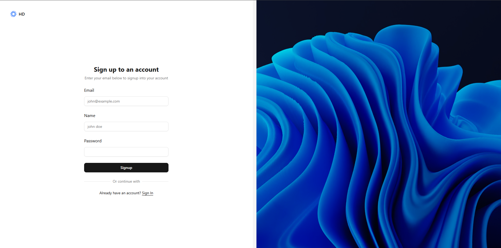
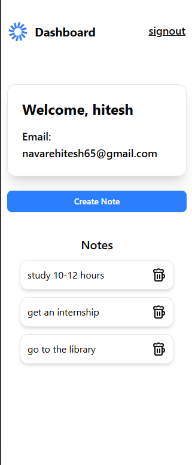
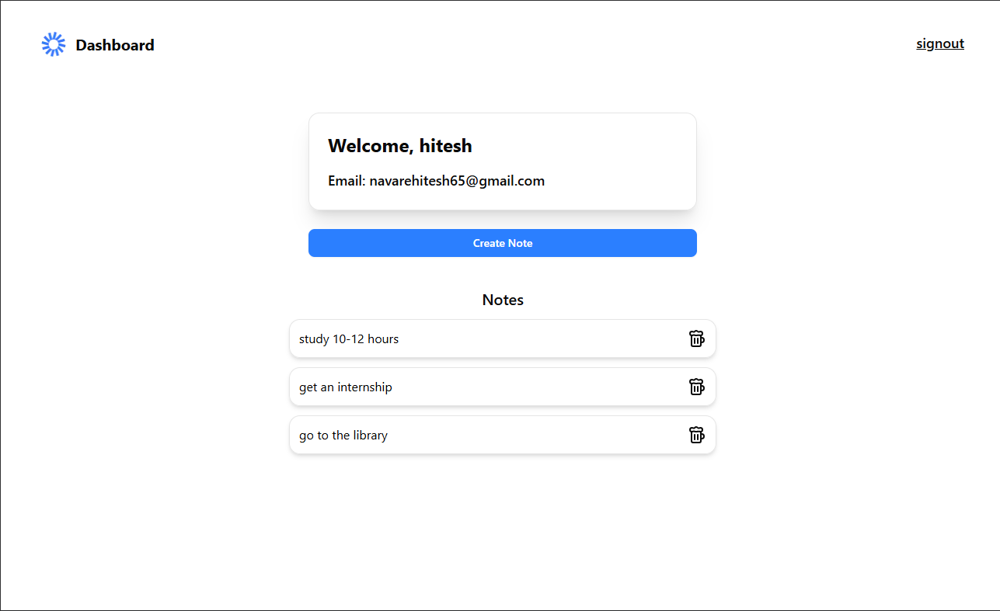

### 📝 Note App ###

A secure and responsive note-taking web application built with Next.js and NextAuth.js.
Users can sign up, sign in (via OTP authentication), and then create and delete personal notes.
Unauthenticated users cannot add or delete notes.

### 🚀 Features ###

🔑 Authentication

Sign up and sign in with NextAuth.

Secure OTP-based login flow.

Only authenticated users can interact with notes.

🗒️ Notes Management

Add new notes.

Delete existing notes.

Notes are tied to the logged-in user (you can’t manage other users' notes).

📱 Responsive Design

Fully mobile-friendly.

Works smoothly across devices (desktop, tablet, and mobile).

### Tech Stack ### 
Frontend: Next.js, React, Tailwind CSS

Authentication: NextAuth.js (with OTP flow)

Backend: Next.js API routes + Database (Prisma + PostgreSQL, depending on your setup)

State Management: React hooks

HTTP Client: Axios

### ScreenShots ###

### SETUP ###

git clone https://github.com/your-username/note-app.git
cd note-app

### Environment variables ### 

NEXTAUTH_URL=http://localhost:3000
NEXTAUTH_SECRET=your_secret_key

# Database connection
DATABASE_URL=your_database_url

# Email/OTP provider setup
EMAIL_SERVER=smtp://your_smtp_config
EMAIL_FROM=your_email@example.com
